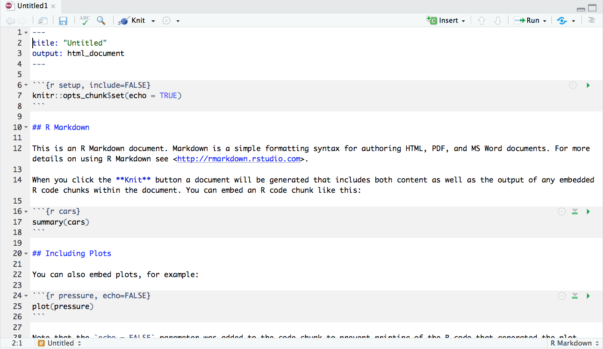

R Markdown for creating reproducible reports
============================================

R scripts
---------

The simplest and most obvious way to document an analysis in R is to save all the code in an R script. If the script includes description and/or code for obtaining the data, and enough comments, we have a decent level of reproducibility already. 

.. important:: 

     R scripts are simple text files containing R commands (one per line) and functions definitions. Comments can be added on lines starting with *#*

On the downside, R scripts can sometimes be difficult to read and cannot contain figures/plots, i.e. they are a great way to automate an analysis and share it with collaborators but not very suitable for making reproducible reports.


Introduction to R Markdown
--------------------------

A *markup* language is a system for annotating text documents in order to e.g. define formatting. *Markdown* is a lightweight markup language which uses plain-text syntax in order to be as human readable as possible. Some examples::


 # Heading

 ## Sub-heading

 ### Another deeper heading

 A [link](http://example.com).

 Text attributes _italic_, *italic*, **bold**, `monospace`.

 Bullet list:

  * apples
  * oranges
  * pears

A markdown document can be converted to formats like HTML or PDF for viewing in a browser or a PDF reader. Markdown is somewhat ill-defined, and as a consequence of that there exists many implementations and extensions (although they share most of the syntax). R Markdown is one such implementation/extension.

R Markdown documents can contain text, chunks of code, or a mixture of text and code. The code snippets can be executed and the output of their execution becomes part of the markdown document and can be included in the final file generated from compiling the markdown. This basically means that you can connect your code, your results and plots together with descriptive text, and you can generate reproducible reports directly from RStudio. Compare this with formatting text and code and copy-pasting figures in a Word document!?!

You can also use R Markdown as a notebook, in the same way as lab notebooks are used in a wet lab setting (or as we use a Jupyter notebook in the tutorial). Notebooks could not be squeezed in into this workshop but knowing the principles and having a look at `RStudio's introduction of Notebooks with R Markdown <https://rmarkdown.rstudio.com/lesson-10.html>`_ can help you get going.

 .. note::
    In addition to executing R code chunks, you can also execute chunks in a variety of other languages like Python, Bash, CSS, JavaScript. See this `link <https://rmarkdown.rstudio.com/authoring_knitr_engines.html>`_ for more information.


The structure of an R Markdown document
---------------------------------------

The best way to understand and learn R Markdown is by using it, so head down to the hands-on session below to learn more about the R Markdown document structure!

Hands-on session
~~~~~~~~~~~~~~~~

Create a new R Markdown document
^^^^^^^^^^^^^^^^^^^^^^^^^^^^^^^^

We will start out by creating of a new document in one of our existing projects:

1. Start RStudio and switch to one of the empty projects created in the previous parts.
2. Select "File" > "New File" > "R Markdown..."
3. In case you get prompted to install a few required packages, please do that!
4. In the window that opens, select HTML in the "Default Output Format" (should be default), leave everything else as it is and click "OK"

 This will open for you the following template R Markdown document in the RStudio Markdown editor:



Take a look through the content of the template to get a feeling for the format. There are three types of components in an R Markdown document:

1. The YAML header
2. Text (written in R Markdown)
3. Code chunks (written in R, or another supported language).

Let's dig deeper into each of them by example. 

The YAML header
^^^^^^^^^^^^^^^

The YAML header is where you configure general settings for the final output file, and a few other things. First, to get a flavor for things let's do the following: 

 - change the title to "My first R Markdown document" and press the little "Knit" button located at the top of the editor panel in RStudio. This will prompt you to save the Rmd file (do that), and will generate the output file (an HTML file in this case). It will also open up a preview of this file for you.
 - now change the output part of the header so that it looks like this::

	  ---
	  title: "My first R Markdown document"
	  output: 
	    html_document:
	      toc: true
	  ---

   Press the "Knit" button again and see how the resulting HTML output differs.


The settings are written in `YAML format <https://en.wikipedia.org/wiki/YAML>`_ in the form *key: value*. Nested settings or sub-settings are indented with spaces. In the template R Markdown document you can see that ``html_document`` is nested under ``output``, and in turn, ``toc`` is nested under ``html_document`` since it is a setting for the HTML output. The table of contents (TOC) is automatically compiled from the section headers (the lines marked by **#**).


Markdown Text
^^^^^^^^^^^^^

Here is an example for some of the most common text formatting in markdown:

::

 # This is a heading

 This is a paragraph.
 This line-break will not appear in the output file.  
 But this will (since the previous line ends with two spaces).

 This is a new paragraph.

 ## This is a sub-heading

 This is **bold text**, this is *italic text*, this is `monospaced text`, 
 and this is [a link](http://rmarkdown.rstudio.com/lesson-1.html).

 An important feature of R Markdown, is that you are allowed to use R code inline
 to generate text by enclosing it with `r `.
 As an example: 112/67 is equal to `r round(112/67, 2)`.
 You can also use multiple commands like this:
 I like `r fruits <- c("apples","bananas"); paste(fruits, collapse=" and ")`!

Paste this markdown snippet in your template R Markdown document and press "Knit" to see the effect.


We cannot go through all the syntax of markdown today, but since you now know how it works, you can always use `The R Markdown Reference Guide <https://www.rstudio.com/wp-content/uploads/2015/03/rmarkdown-reference.pdf>`_ and `The R Markdown Cheatsheet <https://www.rstudio.com/wp-content/uploads/2016/03/rmarkdown-cheatsheet-2.0.pdf>`_ as references when you are writing your markdown documents.


Code chunks
^^^^^^^^^^^
Code chunks are sections in a markdown document containing code in some of the supported programming languages. When you compile your .Rmd file by clicking the "Knit" button, R Markdown will run these code chunks and show the results beneath the code chunk. The results will also show up in your final report.

A chunk section for R code is defined by surrounding it with the chunk delimiters `````{r}`` and ```````, for example:

::

 ```{r}
 round(112/67, 2)
 ```

In the chunk delimiter you specify which programing language the code should be executed in, ``r`` for R code, ``python`` for Python code, ``bash`` for Bash, etc.

Let's get more comfortable with the code chunks by looking at those in your template R Markdown document.

- **The chunk defining global chunk options:**

 ::

  ```{r setup, include=FALSE}
  knitr::opts_chunk$set(echo = TRUE)
  ```

 Here you can define settings that are default for all chunks in this document. For example, ``echo`` will always be set to TRUE, unless otherwise specified in individual chunks. You can find information about the chunks options on pages 2 and 3 in the `The R Markdown Reference Guide <https://www.rstudio.com/wp-content/uploads/2015/03/rmarkdown-reference.pdf>`_.


- **The chunk name:**

 ::

  ```{r cars}
  summary(cars)
  ```
 
 In this case, ``cars`` is the name of this chunk and it has nothing to do with the object "cars" that is passed to summary() in the actual code. The name is optional and it is useful for referencing the chunk and for debugging.

- **The chunk options:**

 After the name of the chuck you can have one or more options, separated by commas.

 ::

  ```{r pressure, echo=FALSE}
  plot(pressure)
  ```

 Here we only have the ``echo`` option set to ``FALSE``. Render the file with the "Knit" button and see how the HTML output looks like. Now you can remove the ``echo`` option from the chunk, render it again and see how the output is different.

 Let's now add two options defining the size of our plot. Type or copy-paste ``fig.width = 6, fig.height = 4`` after the name of the chunk, render and check the output.

 .. note::
    The options specified in that way, i.e. in the chunk itself, do override the global options from the "setup" chunk.

 Here is a short list of some of the most common and often used options:

 ====================  =============================================================================================================================================================
 **Chunk option**      **Effect**
 --------------------  -------------------------------------------------------------------------------------------------------------------------------------------------------------
 ``echo = FALSE``      Prevents code, but not the results, from appearing in the finished file. This is a useful way to embed figures.
 --------------------  -------------------------------------------------------------------------------------------------------------------------------------------------------------
 ``include = FALSE``   Prevents both code and results from appearing in the finished file. R Markdown still runs the code in the chunk, and the results can be used by other chunks.
 --------------------  -------------------------------------------------------------------------------------------------------------------------------------------------------------
 ``eval = FALSE``      The code in the code chunk will not be run (but the code can be displayed in the finished file). Since the code is not evaluated, no results can be shown.
 --------------------  -------------------------------------------------------------------------------------------------------------------------------------------------------------
 ``results = "hide"``  Evaluate (and display) the code, but don't show the results.
 --------------------  -------------------------------------------------------------------------------------------------------------------------------------------------------------
 ``message = FALSE``   Prevents messages that are generated by code from appearing in the finished file.
 --------------------  -------------------------------------------------------------------------------------------------------------------------------------------------------------
 ``warning = FALSE``   Prevents warnings that are generated by code from appearing in the finished file.
 ====================  =============================================================================================================================================================


An example: Creating a PDF report with R Markdown
-------------------------------------------------

Let's go through a complete example in which we will make use of most of the concepts from this workshop. We will checkout a Git repository into an R project and we will run simple R analysis, and we will create a report in PDF format using R Markdown.

1 Create a new project in RStudio by going to the "Clone Git repository" window and using "git\@github.com:valyo/solubility_example.git" as a "Repository URL". You can leave the "Project directory name:" field to have the default name, or you can change it to your liking. The same applies for the "Create a project as a subdirectory of :" field.

2 Explore the R scripts in the project and get familiar with the included datasets 

3 Create an R Markdown file that renders into a PDF report file based on the code in the R script *explore_and_pca.R*.

