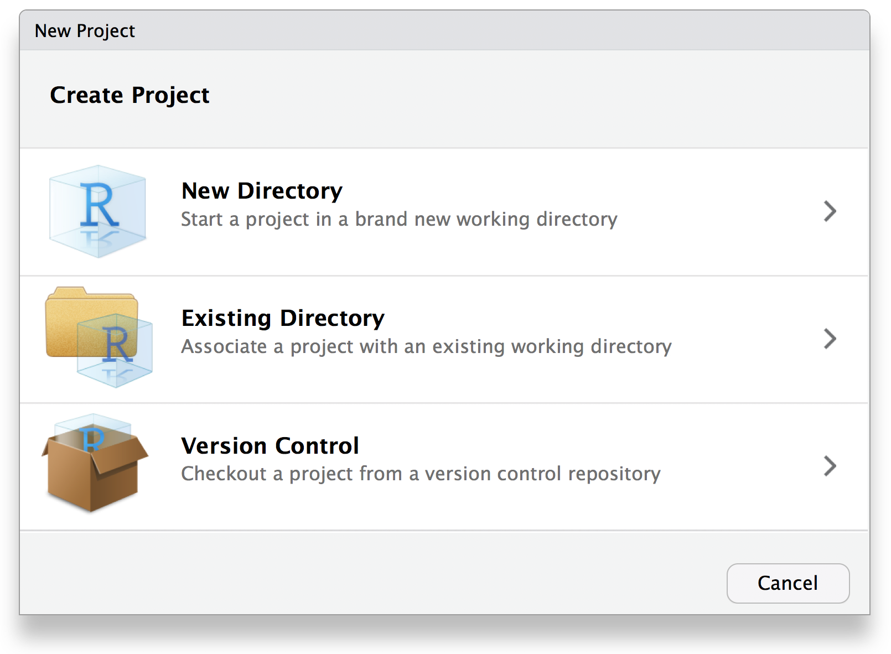
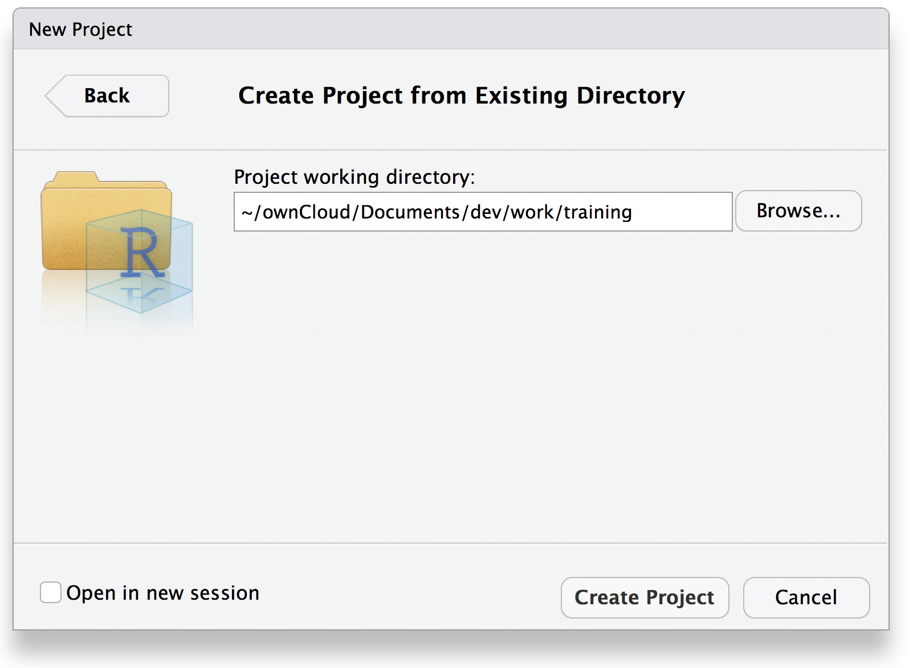

Self-contained projects in RStudio
==================================

This part relates mainly to the "Organization of data and tools" factor that affects the reproducibility of your work.

The problem
-----------
It is quite common situation that files (data, documents, scripts, tools, figures, etc) related to a scientific projects are scattered around on our computers. Even if they are kept in one dedicated directory, the structure inside this directory can be completely or to some extend disordered. This does not only make your work harder, but it makes sharing of the project materials and collaboration an impossible task.

How does R behave
~~~~~~~~~~~~~~~~~
R can be launched in two different ways, from the GUI or from the CLI. 

- When launched via the GUI app it creates a history file .Rapp.history and, if the session gets saved in the end, an .Rdata file in the user home directory. This also means that the user's home directory is R *working directory* for this session. 
- When launched from the CLI, the files mentioned above are created in the current working directory, which becomes *working directory* for R.

This behavior can be changed from the R app Preferences menu or via a file .Rprofile placed in the directory from which R is started. You can in principle achieve decent separation between your projects when using R, but it is not the most straightforward and elegant solution.

How does RStudio behave
~~~~~~~~~~~~~~~~~~~~~~~
RStudio on the other hand, when launched creates an R session with the user's home directory as a *working directory*. This session's environment and the history of R commands are saved in the home directory (.Rdata and .Rhistory files). You can always change the *working directory* to a folder where you have some data and/or scripts.

Hands-on session (optional)
~~~~~~~~~~~~~~~~~~~~~~~~~~~
- Play around with the different ways to start R and RStudio
- Figure out the working directory and try to find it in the file structure on your computer
- Switch back and forth between working directories

Possible solution
-----------------
RStudio has a project management functionality that makes organization of data and tools straightforward. I allows you to create new project and to import existing projects, and importantly, to switch easily between your projects.

Let's see how it works.

Hands-on session
~~~~~~~~~~~~~~~~
We are now going to practice how to create a project from scratch (in a brand new directory), and from an existing directory 

.. **Creating a self-contained project in RStudio:**

Creating a project in a new directory in RStudio
^^^^^^^^^^^^^^^^^^^^^^^^^^^^^^^^^^^^^^^^^^^^^^^^

1. Start RStudio
2. Click the “File” menu button, then “New Project”.

 The following window will appear, giving you three different options:

 .. image:: ../images/new_proj1.png

3. Click "New Directory" and select "New Project" from the list of options. 

 You will get to the following window:

 .. image:: ../images/new_proj2.png

|

 In the field "Directory name" you can fill in a name for your new project, and the field "Create project as subdirectory of:" lets you choose a location for that new directory. You can type or paste the path in the field, or you can click the "Browse..." button and use the GUI to navigate through the file structure to a directory where you want your new project to reside. In the next topic we will look at the "Create a Git repository" option, but let us now just focus on the project creation workflow. 

4. When done with the project name and location you click the button "Create Project" and RStudio will close the current R session and it will open a new session. 
 
 This new session will have the directory that you specified in the previous step as a working directory, and it will have a clean workspace - no history and now objects in the environment. If you did check the box "Open in new session" in that last window, then RStudion would have kept the old session and would have opened the new one in a new RStudio window, i.e. you can have multiple different R sessions running at the same time.

5. Explore your current R session, the working directory, environment, etc.

 Run *sessionInfo()* and look at the output.
  Run *?sessionInfo* to get information about the output of this function

 Run *getwd()* and note the path to the working directory.
  You should get the absolute path to the newly created directory
 
 Use the GUI and/or CLI to go into the working directory and list its content.
  There should be only on file present there, named your_project_name.Rproj

 Create an R object (it doesn't matter if it is a number, or a vector, or a string) and close RStudio.
  You will be asked if you want to save the workspace in an image called .Rdata inside the working directory, click the "Save" button. If you now look into the working directory you will see that two files have appeared - .Rhistory and .RData.

  RStudio will always save the history of your commands in an .Rhistory file, but the objects in your workspace will only be saved if you choose to save the image file .Rdata

 Now you can start RStudio again and you will find out that the object you created is there
  You can see the workspace objects in the pane "Environment" and all the files in the working directory in the pane "Files".

Creating a project in a existing directory in RStudio
^^^^^^^^^^^^^^^^^^^^^^^^^^^^^^^^^^^^^^^^^^^^^^^^^^^^^

1. Clone the following Git repository somewhere on your computer - `<git@github.com:valyo/example.git>`_
2. Create a new project in RStudio by going through the steps from the previous section. This time choose "Existing Directory" from the window:

3. You will get to a window that prompts you to select "Project working directory":

There is no field to write a directory name here, because you are supposed to already have a directory. Use the "Browse..." button to navigate to the location in your file structure where you cloned the Git repository in step **1**. When done, click "Create Project" and RStudio will close the current R session and it will open a new session.

4. Play around in your current R session as you did in step **5** of the previous section.

Switch between projects 
^^^^^^^^^^^^^^^^^^^^^^^

1. In the upper right-hand side corner of the RStudio window you will find the name of your project and if you click on it you will get a drop-down menu with a list of Projects-related items. It looks approximately like this:

 The menu with you project name:

 .. image:: ../images/switch_proj1.png

|
 
 The drop-down list of items:

 .. image:: ../images/switch_proj2.png

|

 As you can see, there are menu items for creating a new project, for opening and closing of a project, and for setting some options for the current project. There is also a list of recently opened projects, from which you can quickly switch between them. You should have the two projects you've just created in this list. 

 .. important:: 

     This element of the RStudio window is called **Project menu** and that's how we will be referring to it in the rest of this material.

 2. Use this menu to switch from your current project to the other one. Test how it works when you change the workspace by creating new objects.

 .. important::

     If you click "Close Project" in the drop-down menu, RStudio will close the current project's session and will open a session with your home directory as a *working directory*.

